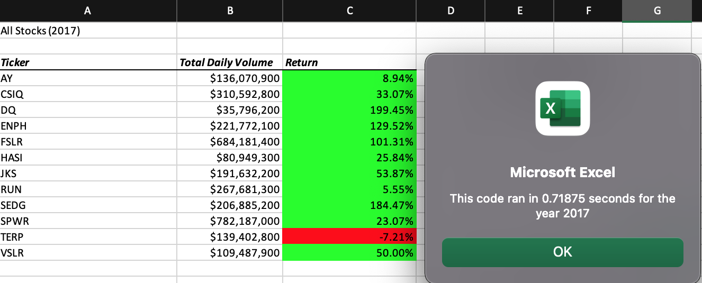
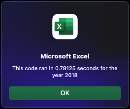

# stock_analysis 
## Overview of Project: Explain the purpose of this analysis.
The purpose of this analysis is to first refactor the code we received 
and apply the concepts we learned to recreate the data. It is key to refactor 
this code in order to pull the data needed in order to analyze the entire stock market.

Results: Using images and examples of your code, compare the stock performance between 2017 and 2018, as well as the execution times of the original script and the refactored script.

For transparency, refactoring the VBA code for myself was unsuccessful. In using
 my original code, I will analyze the data, since the data does match up. 
 Starting with the first ticker (AY), we can easily see comparing All Stocks (2017)
 versus All Stocks (2018) that the return has decreased into the
 negative zone, from 8.94% to -7.28%. If we continue viewing the data, most returns saw a significant decrease into the negative with the exceptions of ticker(ENPH) and ticker(RUN). 
 Although ticker(ENPH) remains in the positive, it also decreased in its return - 
 ticker(ENPH) went from 129.52% to 81.92%. For ticker(RUN), however, it saw an increase of 
 approximately 78% - from 5.55% to 83.95%. Another exception to recognize is ticker (TERP).
 Even though it remained in the negative, it saw a small increase in its return from -7.21% to -5.00%.

Due to unsuccessful refactoring, it is difficult to say if it would be faster with refactored code or not.
What I can say about the process is at the rare times it did run (but not with the correct information),
it seemed to run faster than the code we worked on during Module 2. With my original code, here are the times presented:

In doing an analysis, we can see that the 2017 data took a shorter time running code than the 2018 data. The 2017 data shows a 0.71 time versus
the 2018 data with a 0.78 run time. There is a approximately 0.07 of a second run time difference, if we round to the hundreths spot.

## Summary: In a summary statement, address the following questions.
##### What are the advantages or disadvantages of refactoring code?
One of the advantages of refactoring code is that some of the information is already set up for us, including the formatting, tickers, inputbox, and other information. This saves us time in the long run if we want to focus mainly on figuring out the code that helps us pull data. One of the disadvantages of refactoring code is figuring out where to start the code ,i.e., starting the code from scratch. While trying to figure out the code, there would be some success on running the code, but it only showed one ticker. The problem I ran into mainly was trying to fit tickerIndex into the code. From my understanding, tickerIndex seems to be some type of variable that's supposed to replace i, but once I did that the code would not run.

##### How do these pros and cons apply to refactoring the original VBA script?
I think when we apply the pros and cons to our original code it's seems easier to me when you do the code yourself. Knowing your own code, you can see the errors in your code more easily versus someone else's. Also, it looks like one of the pros to refactoring the original VBA script, it's probably faster running that separate code versus having other macros involved on module.

