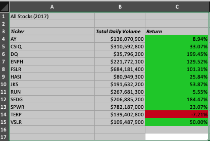
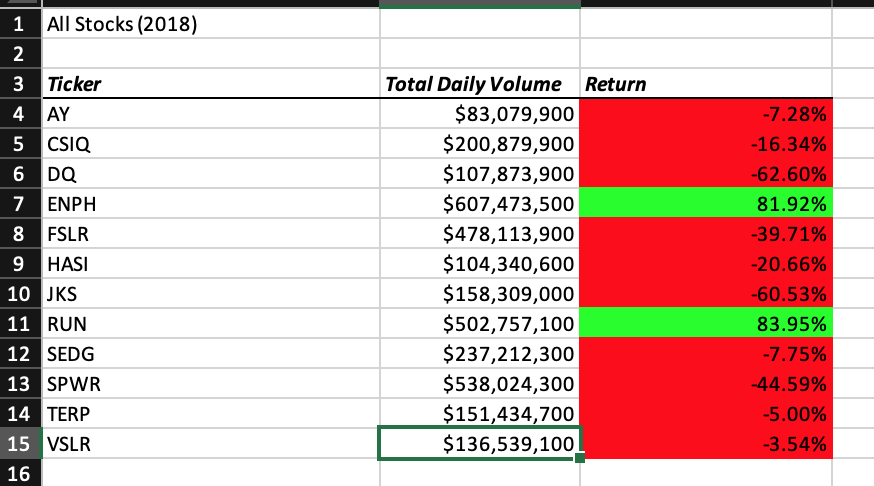

# stock_analysisOverview of Project: Explain the purpose of this analysis.
The purpose of this analysis is to first refactor the code we received 
and apply the concepts we learned to recreate the data. It is key to refactor 
this code in order to pull the data needed in order to analyze the entire stock market.

Results: Using images and examples of your code, compare the stock performance between 2017 and 2018, as well as the execution times of the original script and the refactored script.

For transparency, refactoring the VBA code for myself was unsuccessful. In using
 my original code, I will analyze the data, since the data does match up. 
 Starting with the first ticker (AY), we can easily see comparing All Stocks (2017)
 versus All Stocks (2018) that the total daily volume has decreased into the
 negative zone, from 8.94% to -7.28%. If we continue viewing the data, most total daily
 volumes saw a significant decrease into the negative with the exceptions of ticker(ENPH) and ticker(RUN). 
 Although ticker(ENPH) remains in the positive, it also decreased in its return - 
 ticker(ENPH) went from 129.52% to 81.92%. For ticker(RUN), however, it saw an increase of 
 approximately 78% - from 5.55% to 83.95%. Another exception to recognize is ticker (TERP).
 Even though it remained in the negative, it saw a small increase in its return from -7.21% to -5.00%.

Due to unsuccessful refactoring, it is difficult to say if it would be faster with refactored code or not.
What I can say about the process is at the rare times it did run (but not with the correct information),
it seemed to run faster than the code we worked on during Module 2. 

Summary: In a summary statement, address the following questions.
What are the advantages or disadvantages of refactoring code?
One of the advantages of refactoring the code is that some information is already filled out to save on time to focus on the more important parts on our analysis.

How do these pros and cons apply to refactoring the original VBA script?
