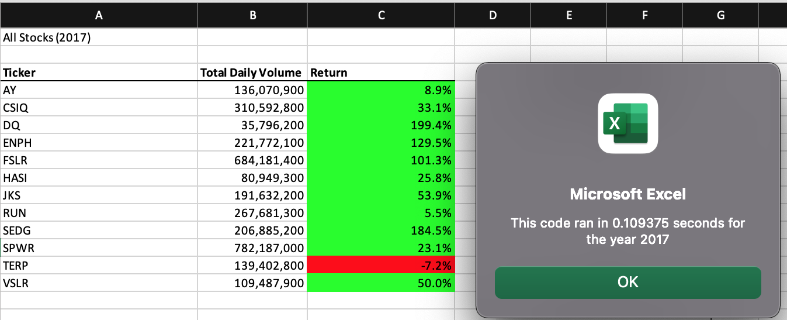
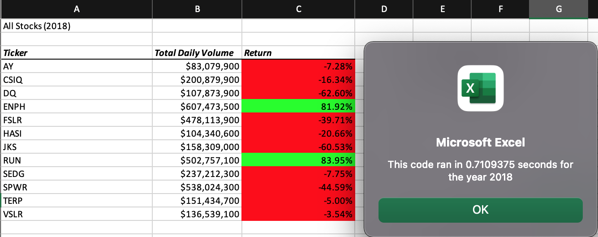

# stock_analysis 
## Overview of Project: Explain the purpose of this analysis.
The purpose of this analysis is to first refactor the code we received 
and apply the concepts we learned to recreate the data. It is key to refactor 
this code in order to pull the data needed in order to analyze the entire stock market.

## Results: Using images and examples of your code, compare the stock performance between 2017 and 2018, as well as the execution times of the original script and the refactored script.

 Starting with the first ticker (AY), we can easily see comparing All Stocks (2017)
 versus All Stocks (2018) that the return has decreased into the
 negative zone, from 8.94% to -7.28%. If we continue viewing the data, most returns saw a significant decrease into the negative with the exceptions of ticker(ENPH)   and ticker(RUN). Following the trend, ticker(CSIQ) went from a 33.07% return to a negative -16.34% return. From the data, it seems as if the ticker most affected was ticker(DQ0) with a whooping return decrease from 199.45% to -62.60%.
 Although ticker(ENPH) remains in the positive, it also decreased in its return - 
 ticker(ENPH) went from 129.52% to 81.92%. For ticker(RUN), however, it saw an increase of 
 approximately 78% - from 5.55% to 83.95%. Another exception to recognize is ticker (TERP).
 Even though it remained in the negative, it saw a small increase in its return from -7.21% to -5.00%.

Now, if we look at run times between the refactored (pictured above) and the original code (pictured below), we can see that the refactored code had a faster run time. For All Stocks (2017), rounding to the thousanth place, the refactored took 0.109 seconds to run versus the original, which took 0.719 seconds. There is approximately a 0.6 second difference between the two. For All Stocks (2018), there is a similar story to be seen here. The refactored took 0.125 seconds versus the original which took 0.711 seconds to run. There is also approximately 0.6 second difference. It is easy to conlude that the refactored code took a faster time to run the data. Besides run time, another thing to mention is the difference in the rounding for the return. The refactored code rounded to the tenth place, while the original code rounded to the hundreth place. Depending on the needs of the company, that can easily be changed with some simple coding.

## Summary: In a summary statement, address the following questions.
##### What are the advantages or disadvantages of refactoring code?
One of the advantages of refactoring code is that some of the information is already set up for us, including the formatting, tickers, inputbox, and other information. This saves us time in the long run if we want to focus mainly on figuring out the code that helps us pull data. One of the disadvantages of refactoring code is figuring out where to start the code ,i.e., starting the code from scratch. While trying to figure out the code, there would be some success on running the code, but it only showed one ticker. The problem I ran into mainly was trying to fit tickerIndex into the code. From my understanding, tickerIndex seems to be some type of variable that's supposed to replace i, but once I did that the code would not run. After numerous trial and error, however, the refactored code finally began to ran. 

##### How do these pros and cons apply to refactoring the original VBA script?
I think when we apply the pros and cons to our original code it's seems easier to me when you do the code yourself. Knowing your own code, you can see the errors in your code more easily versus someone else's. Another con to the refactored code is not knowing exactly how detailed the numeric data may be. In the analysis, I mentioned that the refactored code only rounded to the tenth place, while the original code is rounded to the hundreth place. Obviously, we can change that depending how crucial it is to show the return to the nth decimal point. We can easily format it,i.e., Cells(x,y).NumberFormat = "0.000%" or however many decimal points needed. Also, it looks like one of the pros to refactoring the original VBA script is the running time. As stated in the analysis, the refactored code ran through the data faster than the original.
